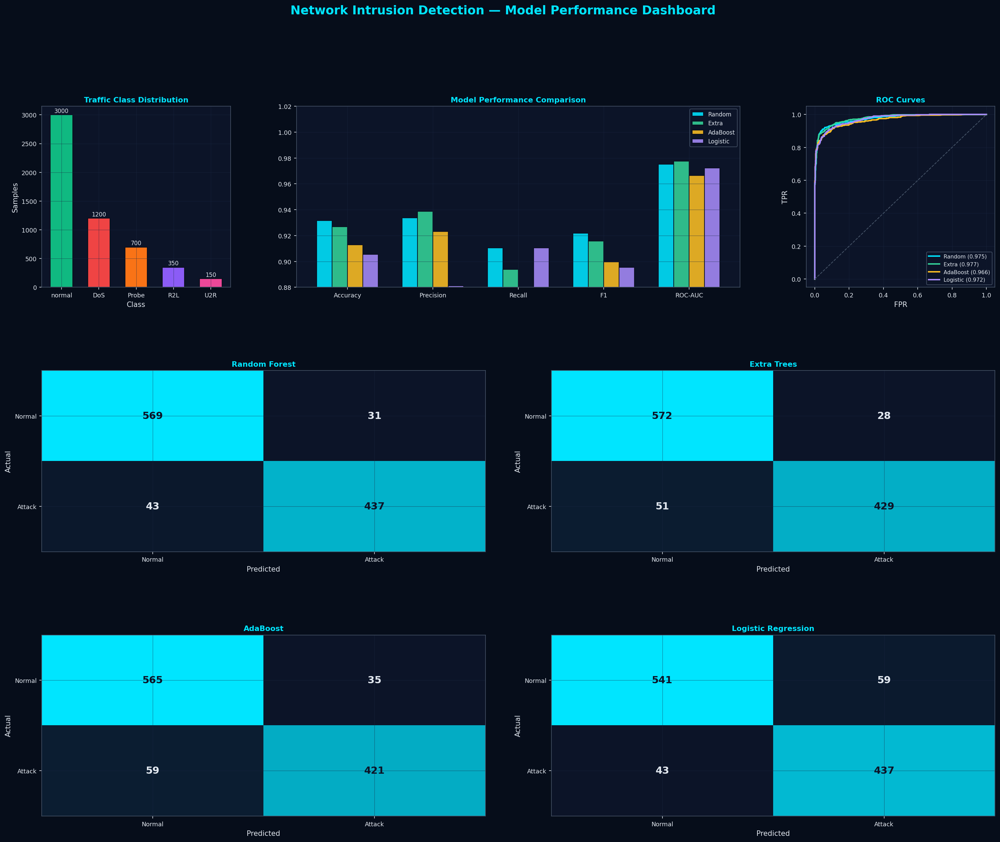
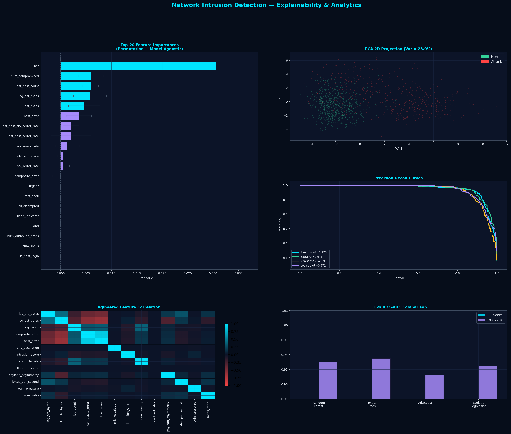
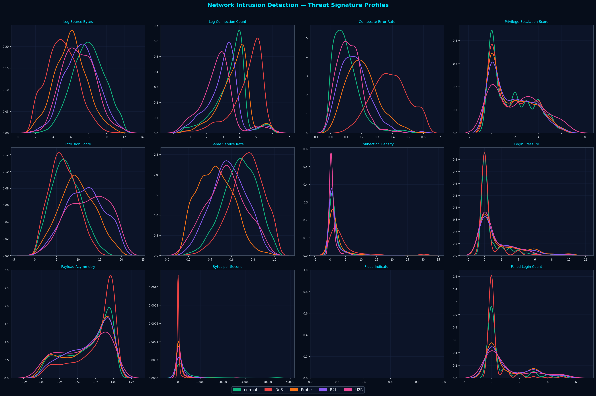

# Network Intrusion Detection System

ML pipeline to detect network attacks (DoS, Probe, R2L, U2R) using Random Forest & Extra Trees on NSL-KDD dataset. Achieves 93% accuracy, F1=0.92, AUC=0.97 with feature engineering and permutation-based explainability.


---

## Results

| Model | Accuracy | F1-Score | ROC-AUC |
|---|---|---|---|
| Random Forest | **0.9315** | **0.9219** | 0.9752 |
| Extra Trees | 0.9269 | 0.9157 | 0.9774 |
| AdaBoost | 0.9130 | 0.8996 | 0.9663 |
| Logistic Regression | 0.9056 | 0.8955 | 0.9722 |

5-Fold Cross-Validation F1: **0.9157 ± 0.0067**

---

## Dashboards

**Model Performance** — ROC curves, confusion matrices, metric comparison



**Explainability** — Feature importances, PCA projection, precision-recall curves



**Attack Profiles** — KDE threat signature per attack category



---

## Dataset

NSL-KDD benchmark aligned — 5,400 samples across 5 classes.

| Class | Type | Samples |
|---|---|---|
| Normal | Legitimate traffic | 3,000 |
| DoS | Denial of Service | 1,200 |
| Probe | Reconnaissance / Port scan | 700 |
| R2L | Remote-to-Local | 350 |
| U2R | User-to-Root / Privilege escalation | 150 |

---

## Feature Engineering

16 domain-specific features added on top of 41 raw NSL-KDD features (57 total).

| Feature | Purpose |
|---|---|
| `composite_error` | Mean SYN + RST error rate — DoS/Probe signal |
| `priv_escalation` | Root shell + su + num_root score — U2R signal |
| `intrusion_score` | Compromised + file + access count — R2L/U2R signal |
| `flood_indicator` | Binary flag: count > 400 — fast DoS pre-filter |
| `login_pressure` | Failed logins × (1 − logged_in) — brute-force signal |
| `log_src_bytes` | Log-normalised source bytes — volume anomaly |
| `conn_density` | count / srv_count — Probe/DoS rate |
| `payload_asymmetry` | |src − dst| / total bytes — exfiltration signal |

---

## How to Run

```bash
# 1. Clone the repo
git clone https://github.com/Lakshminarayan566/network-intrusion-detection.git
cd network-intrusion-detection

# 2. Install dependencies
pip install -r requirements.txt

# 3. Run pipeline
python code/nids_pipeline.py
```

Outputs are saved to the `results/` folder automatically.

---

## Project Structure

```
network-intrusion-detection/
├── code/
│   └── nids_pipeline.py
├── results/
│   ├── dashboard1_model_performance.png
│   ├── dashboard2_explainability.png
│   └── dashboard3_attack_profiles.png
├── README.md
├── requirements.txt
└── .gitignore
```

---

## Pipeline Steps

```
Raw Traffic (41 features)
        ↓
Feature Engineering  →  57 features
        ↓
StandardScaler  →  fit on train only
        ↓
4 Models trained with class_weight='balanced'
        ↓
Evaluation: Accuracy, F1, AUC, Confusion Matrix
        ↓
Permutation Importance  →  explainability
        ↓
3 Dashboards saved to results/
```

---

## References

- Tavallaee et al. (2009). A Detailed Analysis of the KDD CUP 99 Data Set. CISDA, IEEE.
- Sharafaldin et al. (2018). Toward Generating a New Intrusion Detection Dataset. ICISSP.
- Breiman (2001). Random Forests. Machine Learning, 45(1).
- Scikit-learn: Pedregosa et al., JMLR 12, 2825–2830, 2011.

---

